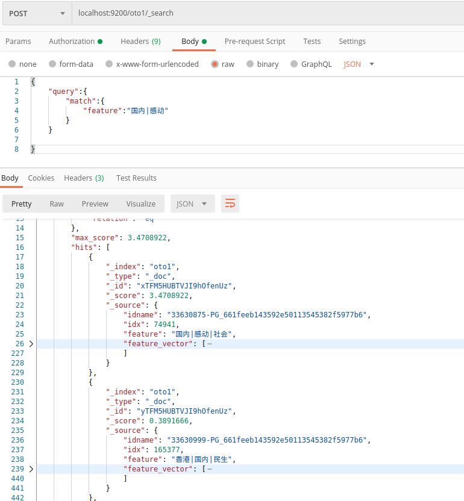
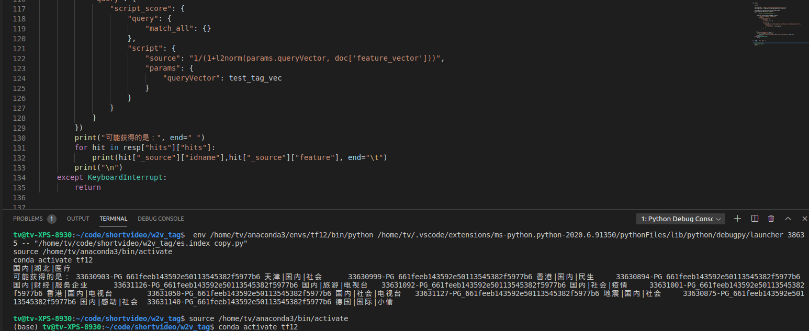

# 基于ElasticSearch的语义搜索
训练词向量语义模型，可对tags，标题，描述等汇总求的节目的句向量，不再基于关键词匹配，而是语义向量距离匹配。
## 环境
gensim==3.8.3
gieba==0.42
elasticsearch

## 使用
建立索引，插入数据，测试
wget es压缩包，改下权重，./elasticsearch 可以看到  publish_address {192.168.24.89:9200}
Postman打开，POST，localhost:9200/oto1/_search
body填写 
{
    "query":{
        "match":{
            "feature":"国内|感动"
        }
    }

}
即可有结果

