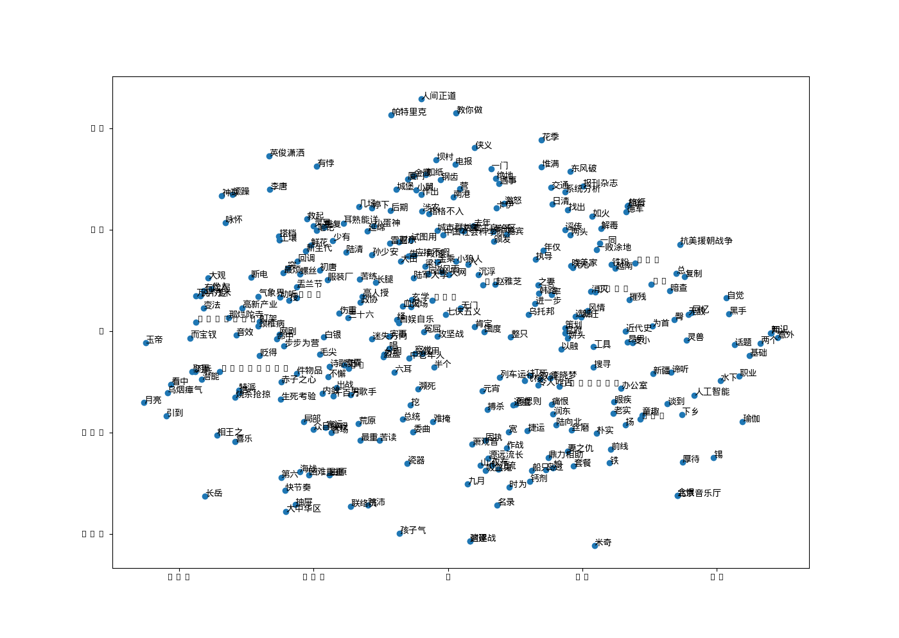

# 语义特征 word2vec

items表中的 category,tags,description,title,导演,演员等等文本信息构建自己的语料库,利用gensim的word2vec 训练自己的词向量,
这样,就可以基于 $\color{red}{语义信息}$,  语义信息 做更多下游的任务,比如视频描述的关键词权重*词向量,来做召回或排序,更加准确.

## 环境
gensim==3.8.3
gieba==0.42
## 现在
- category,tags,description构建语料
- 数据量太少,太单一,结果欠佳

## todo
- 中文wiki,增加自己的关键词,
- 利用tensorflow来搭建word2vec模型
- 加入更多文本信息
